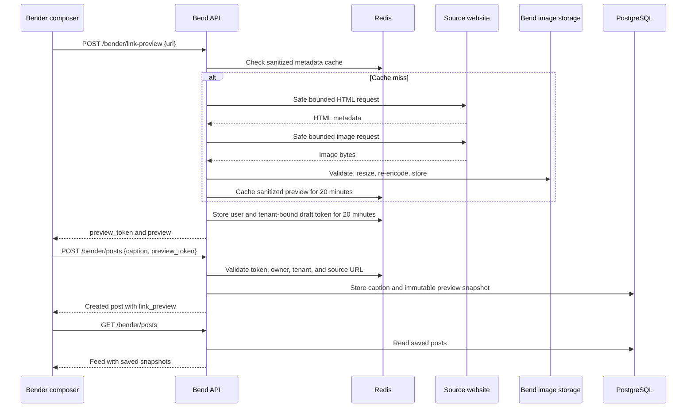

# Bender Link Previews Design

**Status:** Approved
**Date:** 2026-08-20
**Target:** Bender composer and feed on all Bend tenants

## Summary

Bender posts that contain a public HTTP or HTTPS link will offer a Facebook-style preview before publishing. A successful preview becomes an immutable part of the post, so the feed remains fast and does not contact the source website for every reader.

The Bend backend will fetch and sanitize Open Graph metadata, copy a valid preview image into Bend-managed storage, and return a short-lived preview token. The post creation request may include that token. The backend will bind the token to the signed-in user, tenant, and exact source URL before saving the preview snapshot with the post.

Preview generation is best effort. A blocked, private, malformed, slow, or metadata-free website must never stop someone from publishing a normal text or media post.

## Goals

- Show a useful title, description, site name, and image for the first public link in a Bender caption.
- Let the author review or remove the preview before publishing.
- Preserve the normalized caption in storage while avoiding a redundant raw URL above a successful preview card.
- Keep older Bender posts and API clients fully compatible.
- Prevent server-side request forgery, oversized downloads, unsafe source HTML, and hotlinking.
- Keep feed reads deterministic and independent of third-party website availability.

## Non-goals

- Multiple preview cards in one post.
- Embedded video, scripts, iframes, or interactive third-party widgets.
- A general-purpose URL-fetch API for other features.
- Editing or refreshing a preview after the post is published.
- Guaranteeing a preview for Facebook, Instagram, login-gated pages, or websites that block automated requests.
- Adding Open Graph metadata to Bender's own public share pages. That can be designed separately.

## Current state

- `BenderPost` stores caption and optional uploaded media, but no link metadata.
- `POST /api/v1/bender/posts` accepts caption and media fields only.
- Feed responses return caption and media fields only.
- `BenderPage.tsx` renders captions as plain text. URLs are neither linkified nor previewed.
- The backend already provides PostgreSQL, Redis, Celery Beat, Pillow, Beautiful Soup, HTTP clients, and a shared `/uploads` volume.

## Approved user experience

### Composer

1. The composer detects the first syntactically valid `http://` or `https://` URL in the caption.
2. After a 400 ms debounce, it requests a preview from the Bend backend.
3. While the request is active, a compact loading card appears below the caption field.
4. A successful response replaces the loading card with the image, title, description, and site name that are available.
5. The caption remains fully editable and continues to show the raw URL in the editor.
6. The author may remove the preview. It remains dismissed while that same first URL remains in the caption.
7. Changing or removing the first URL cancels the old request, invalidates its result in the UI, and allows a preview request for the new first URL.
8. If the author presses Post while the current preview is loading, the composer waits up to five seconds for that request. It then publishes with the preview if ready, or publishes without one if preview generation failed or timed out.

### Published post

- A successful snapshot renders as one clickable card below the caption and above any uploaded post media.
- The card opens the stored canonical URL in a new tab with `noopener` and `noreferrer` protections.
- Only the exact first occurrence of the previewed source URL is omitted from the displayed caption. Surrounding text, punctuation, line breaks, and any additional URLs remain visible.
- The full normalized caption remains stored and returned by the API. As in the current post flow, normalization trims leading and trailing whitespace but does not otherwise rewrite the caption. Removing the URL is a presentation rule, not a data rewrite.
- URLs that remain in the displayed caption are rendered as safe, clickable HTTP or HTTPS links.
- A preview without an image renders as a text-only card.
- When no preview snapshot exists, all valid caption URLs remain visible and clickable.

### Failure behavior

- An unreachable, blocked, unsupported, or metadata-free page falls back to the normal linkified caption.
- A preview endpoint error does not show a blocking composer error and does not disable Post.
- An expired, missing, mismatched, or otherwise unusable preview token is ignored during post creation. The post is still created without a preview.
- Existing posts with no `link_preview` value render exactly as they do today, except that HTTP and HTTPS text becomes clickable.

## Architecture



The public feed never fetches source websites. Only the authenticated preview endpoint performs an outbound request.

## API contracts

### Generate preview

`POST /api/v1/bender/link-preview`

Authentication is required. The endpoint uses the existing Redis rate-limit dependency with a feature-specific limit of 10 requests per user per minute.

Request:

```json
{
  "url": "https://example.org/community/event"
}
```

`url` is limited to 2,048 characters before parsing.

Successful response:

```json
{
  "preview_token": "opaque-url-safe-token",
  "preview": {
    "source_url": "https://example.org/community/event",
    "url": "https://example.org/community/event",
    "title": "Community Event",
    "description": "Details about the upcoming community event.",
    "site_name": "Example Community",
    "image_url": "/uploads/link-previews/sha256.webp"
  }
}
```

`source_url` is the exact URL submitted by the composer after surrounding punctuation is excluded. `url` is a safe `og:url` when one is supplied, or otherwise the final fetched URL after validated redirects. The selected `og:url` is canonicalized, DNS-resolved, and checked as a public destination, but it is not fetched as an additional page. At least `title` must be present for a preview card to be created.

The endpoint uses normal status codes for diagnostics:

- `400` for malformed or disallowed URLs.
- `401` for unauthenticated callers.
- `413` when a source response exceeds a configured limit.
- `422` when the page is valid HTML but has no usable title.
- `429` when the preview rate limit is exceeded.
- `502` for invalid upstream content or an upstream connection failure.
- `503` when Redis is unavailable for the preview draft handoff.
- `504` for the total request timeout.

The composer treats all non-authentication preview failures as a plain-link fallback.

### Create post

`POST /api/v1/bender/posts` gains one optional field:

```json
{
  "caption": "Join us: https://example.org/community/event",
  "preview_token": "opaque-url-safe-token"
}
```

`preview_token` is optional and limited to 128 characters. Existing clients remain valid.

When a token is supplied, the backend looks up its SHA-256 digest in Redis and accepts the snapshot only when all of these conditions hold:

- The token has not expired.
- Its `user_id` equals the authenticated user.
- Its nullable `tenant_id` equals the authenticated user's tenant.
- Its `source_url` still appears as an exact URL token in the submitted caption.
- The stored snapshot passes the response-schema limits.

Failure of any preview check causes the backend to ignore the preview token and create the post normally. It never trusts preview fields sent directly by the client.

### Feed and create response

`BenderPostResponse` gains one nullable field:

```json
{
  "link_preview": {
    "source_url": "https://example.org/community/event",
    "url": "https://example.org/community/event",
    "title": "Community Event",
    "description": "Details about the upcoming community event.",
    "site_name": "Example Community",
    "image_url": "/uploads/link-previews/sha256.webp"
  }
}
```

The field is `null` for old posts and posts created without an accepted token.

## Data model

Add a nullable PostgreSQL `JSONB` column named `link_preview` to `bender_posts`. The stored object is an immutable versioned snapshot:

```json
{
  "version": 1,
  "source_url": "https://example.org/community/event",
  "url": "https://example.org/community/event",
  "title": "Community Event",
  "description": "Details about the upcoming community event.",
  "site_name": "Example Community",
  "image_url": "/uploads/link-previews/sha256.webp"
}
```

Field limits after whitespace normalization and HTML entity decoding:

| Field | Limit | Required |
| --- | ---: | --- |
| `source_url` | 2,048 characters | yes |
| `url` | 2,048 characters | yes |
| `title` | 180 characters | yes |
| `description` | 300 characters | no |
| `site_name` | 80 characters | no |
| `image_url` | 500 characters | no |

No source HTML is stored. The migration is additive and leaves existing rows as `NULL`.

## URL extraction and caption display

The frontend and backend share behavior through matching test fixtures rather than a hidden browser-only convention:

- Match only explicit HTTP or HTTPS URLs.
- Exclude common trailing sentence punctuation and unmatched closing brackets from the detected URL.
- Select the first valid URL in document order.
- Treat a changed scheme, host, path, query, or fragment as a changed URL.
- During post creation, the backend extracts URL tokens again and requires one to exactly equal the token's `source_url`.

The feed keeps the normalized `post.caption` unchanged. A pure rendering helper removes only the first exact occurrence of `link_preview.source_url`, trims whitespace created solely by that omission, and linkifies the remaining HTTP or HTTPS tokens. It renders React text and anchor nodes only. It never injects HTML.

## Preview metadata selection

The backend parses the final HTML document and chooses values in this order:

- Title: `og:title`, then Twitter title, then `<title>`.
- Description: `og:description`, then Twitter description, then the standard meta description.
- Site name: `og:site_name`, then the final hostname.
- Destination: canonicalized and DNS-validated `og:url` when public and safe, otherwise the final fetched URL. The `og:url` is not fetched as another HTML page.
- Image: `og:image:secure_url`, `og:image`, Twitter image, `link[rel="image_src"]`, structured-data `image` or `logo`, a suitable page hero, banner, or logo image, then a page icon as the last fallback.

Relative metadata URLs are resolved against the final fetched page URL. Every metadata URL goes through the same canonicalization and public-destination checks as the initial request.

The HTML fallback considers only a bounded set of candidates. It prefers images whose element or nearby container identifies them as a hero, banner, cover, logo, or brand image, then suitable images in the main article. It skips data URLs, SVG, known tracking dimensions, hidden elements, and tiny decorative images. The backend attempts at most four image candidates in priority order and stops after the first one that passes network and image validation.

All text fields are HTML entity-decoded, collapsed to plain text, trimmed, and truncated to the documented limits. Tags, scripts, style content, and source markup never reach the client.

## Safe external fetching

Create a dedicated `SafeExternalFetcher` for this feature. It must not expose a generic proxy route.

### URL validation

- Accept only `http` and `https`.
- Accept only ports 80 and 443, with default-port normalization.
- Reject credentials, backslashes, control characters, invalid ports, and malformed percent encoding. Strip the fragment from the outbound request while preserving the exact `source_url` for caption binding.
- Normalize the hostname with UTS 46 IDNA before DNS resolution.
- Reject `localhost`, `.localhost`, single-label hosts, and ambiguous numeric host forms that browsers can reinterpret as IPv4, including integer, hexadecimal, octal, short, mixed, full-width, and ideographic-dot forms.
- Allow a literal IP only when it is in canonical IPv4 or IPv6 notation and is globally routable.
- Reject loopback, private, link-local, multicast, reserved, unspecified, carrier-grade NAT, documentation, and other non-global addresses.

### DNS and connection handling

- Resolve all A and AAAA answers before connecting and reject the destination if any candidate is non-global.
- Pin the outbound connection to one of the validated resolved addresses while preserving the normalized hostname for the HTTP Host header and TLS server-name verification.
- Do not depend only on a preflight DNS check. The network transport must either use the pinned address or verify the connected peer address before accepting bytes.
- Disable environment-derived proxies with `trust_env=False` and prohibit feature-level proxy configuration. HTTP proxy, HTTPS proxy, and no-proxy environment variables must not change the selected destination or transport.
- Disable automatic redirects. Follow at most three redirects manually, validating and resolving every destination again.
- Apply the same rules to page URLs, metadata URLs, and image URLs.

### Request limits

- One monotonic server deadline of 4.5 seconds covers DNS, connection setup, every redirect, HTML streaming, image candidates, decoding, and image processing. This finishes inside the composer's five-second wait. If usable text metadata is ready when only the image portion reaches the deadline, return a text-only preview.
- Maximum HTML body: 512 KiB after HTTP content decoding, enforced while streaming before the body is buffered. A declared Content-Length above the same limit may be rejected earlier.
- Maximum image body: 3 MiB after HTTP content decoding, enforced while streaming. A declared Content-Length above the same limit may be rejected earlier.
- Send a fixed Bend preview user agent and conservative `Accept` headers.
- Send no browser cookies, authorization header, proxy authorization, or referrer from the user's request.
- Do not forward arbitrary client headers.
- Require an HTML-compatible Content-Type for the page and verify decoded image content with Pillow rather than trusting the image Content-Type or extension.

## Image processing and retention

- Accept decoded JPEG, PNG, or WebP only. Animated input is reduced to the first frame.
- Apply Pillow decompression-bomb protection and reject images over 20 megapixels.
- Correct orientation, resize within 1,200 by 630 pixels without upscaling, strip metadata, and re-encode as a non-animated WebP.
- Name the stored file from the SHA-256 digest of the normalized output bytes. This deduplicates identical images without trusting source filenames.
- Store it under `/uploads/link-previews/` on the shared production upload volume.
- Write through a temporary file followed by an atomic rename.
- If image retrieval or processing fails but usable text metadata exists, return and save a text-only preview.

Celery Beat runs a daily cleanup task. It removes a link-preview image only when the file is older than 30 days, no `bender_posts.link_preview` row references it, and no live Redis preview cache or draft references it. Cleanup is idempotent and logs counts, not URLs.

## Redis records

Use two record types with a 20-minute TTL:

- `bender:link-preview:cache:{sha256(normalized_request_url)}` stores request-independent sanitized metadata. It does not contain `source_url`. After a redirect, the same metadata may also be written under the final canonical URL hash so either form can hit the cache.
- `bender:link-preview:draft:{sha256(token)}` stores the snapshot plus `user_id`, nullable `tenant_id`, `source_url`, and creation time.

The returned token contains at least 256 bits of cryptographically secure randomness and is never logged. A cache hit still creates a new user-bound draft token. Each response and draft injects the current request's exact `source_url`; it never reuses a previous requester's value. Raw source URLs are values, not Redis key material.

Redis is an optimization and handoff mechanism, not a posting dependency. If it is unavailable, preview generation may fail, but normal Bender post creation and feed reads continue.

## Frontend state and components

Add one reusable `BenderLinkPreviewCard` with composer and feed modes.

Composer state includes:

- detected first URL;
- loading, success, dismissed, or unavailable status;
- current preview and token;
- request generation identifier;
- active `AbortController`;
- the URL for which the author dismissed the preview.

The composer debounces URL changes, cancels superseded requests, and ignores any response whose generation identifier or URL no longer matches current state. Editing non-URL caption text does not re-fetch the same successful preview. Removing a preview clears the token from the pending post payload.

The feed card:

- uses an image aspect ratio close to Open Graph's 1.91:1 convention;
- resolves the Bend-managed `/uploads/link-previews/...` path with the existing `resolveAssetUrl()` helper so tenant-domain pages load the image from the API host;
- reserves image space to avoid layout shift;
- uses `object-fit: cover` and a text-only layout when there is no image;
- constrains long words and URLs at desktop and mobile widths;
- has one accessible link name derived from title and site name;
- remains usable at 320px, 390px, 430px, and desktop widths.

## Privacy, abuse controls, and observability

- Only signed-in users can request previews.
- Limit each user to 10 preview requests per minute.
- Record success, cache hit, blocked destination, timeout, invalid content, oversized response, and image-processing failure as bounded counters.
- Logs may include the normalized hostname and error class. They must not include full URLs, query strings, tokens, page text, or image bytes.
- Client-facing errors remain generic and do not reveal resolved IP addresses or network topology.
- The preview card displays source-provided text as untrusted plain text.

## Testing strategy

### Backend unit and API tests

- First-link extraction, trailing punctuation, brackets, queries, fragments, and multiple links.
- Valid public HTTP and HTTPS URLs.
- Credentials, invalid ports, localhost, private networks, cloud metadata, IPv4 and IPv6 literals, ambiguous numeric hosts, full-width and ideographic host forms, backslashes, and malformed URLs.
- DNS answers containing a non-global address, pinned connections, DNS rebinding resistance, and each redirect hop.
- Redirect loop and more than three redirects.
- Monotonic 4.5-second server deadline, streamed 512 KiB decoded HTML limit, streamed 3 MiB decoded image limit, and compressed expansion beyond either limit.
- Proxy-related environment variables do not alter routing because the preview transport disables environment proxies.
- Open Graph, Twitter, HTML fallback ordering, relative URLs, entity decoding, text truncation, and markup removal.
- JPEG, PNG, and WebP validation; MIME spoofing; malformed image; decompression bomb; animation; resize; metadata stripping; deterministic filename; and text-only fallback.
- Redis metadata cache, token ownership, tenant binding, expiry, URL binding, cache hit, and Redis outage.
- Post creation with a valid token, no token, expired token, cross-user token, cross-tenant token, and caption changed after preview.
- Feed serialization for new snapshots and legacy `NULL` rows.
- Idempotent cleanup that preserves referenced and recent files.

Network tests use a controlled local transport or fake resolver. They do not depend on public websites.

### Frontend Playwright tests

- Loading, success, text-only, remove, retry-through-URL-change, and failed-preview states.
- Stale response is ignored after the first URL changes.
- Post waits for the active preview for at most five seconds.
- Post succeeds after preview failure, timeout, or unusable token.
- Successful post sends only `preview_token`, never preview metadata.
- Published card hides the previewed URL, preserves surrounding text, and keeps additional URLs visible and clickable.
- Existing posts without snapshots remain usable.
- Desktop and mobile containment, keyboard focus, accessible names, and long metadata.
- Bend-managed preview image paths resolve through the API host on a tenant domain.

## Migration and deployment

1. Add and test the nullable `bender_posts.link_preview` JSONB migration.
2. Deploy backend, worker, and Celery Beat code. The existing backend startup runs `alembic upgrade head` before serving traffic.
3. Confirm backend health, migration head, Redis access, worker readiness, and the shared upload path.
4. Deploy the frontend that can request and render previews.
5. Run a controlled production smoke test with one public page that supplies Open Graph metadata and an image.
6. Verify composer preview, saved post snapshot, feed rendering, image delivery from Bend storage, mobile containment, and plain-link fallback.
7. Remove the controlled test post if it is not intended to remain public.

The deployment order is backward compatible. New backend responses add a nullable field, and the new database column is nullable. Rolling the frontend back leaves harmless snapshots in the database. Rolling the backend code back after the additive migration also remains safe because the old model ignores the unused column.

## Acceptance criteria

- A signed-in user can paste a supported public link, review its preview, publish it, and see the same snapshot in the feed.
- A published preview never depends on a reader contacting the source website.
- The successful card does not duplicate its source URL in the visible caption.
- Additional URLs and surrounding caption text remain visible.
- Removing or failing a preview still produces a normal post.
- No tested private, local, metadata-service, malformed numeric, Unicode-confusable, redirect, or DNS-rebinding destination is fetched.
- Existing Bender posts, media posts, likes, comments, deletion, pagination, and anonymous feed reads continue to work.
- Backend tests, frontend build, Playwright tests, and production smoke checks pass before completion is reported.
